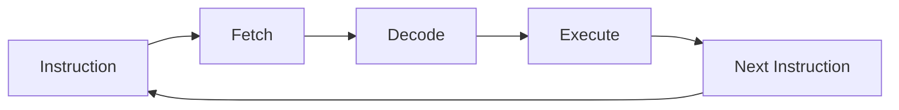
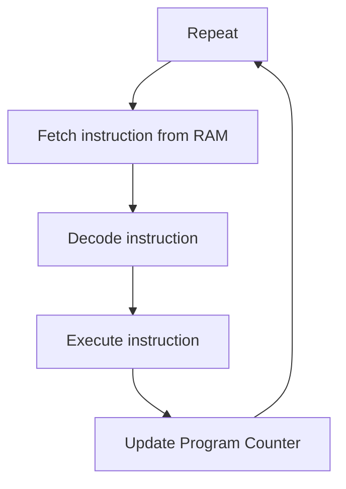

# Instruction Cycle &mdash; How CPU Executes Programs

By now, we learnt that all programs eventually become **machine instructions**.  
But how does the CPU actually execute these instructions?  
The CPU follows a repeating loop called the **Instruction Cycle**.

This cycle runs **billions of times per second**.

---

# The Instruction Cycle

Every CPU executes instructions using three main steps:  
- Fetch
- Decode
- Execute  

This cycle repeats continuously while the program is running.  


---

# Step 1 &mdash; Fetch

The CPU first **fetches the instruction from memory (RAM)**.  
To know which instruction to fetch, the CPU uses something called the **Program Counter (PC)**.  
The Program Counter stores the **address of the next instruction**.

Example:

```
Program Counter -> 0x1000
```
The CPU goes to that memory location and **reads the instruction**.  
```
RAM:
  0x1000 : ADD R1, R2
  0x1004 : STORE R3
  0x1008 : JUMP 0x2000
```
The CPU fetches the instruction located at the address in the **Program Counter**.

---

# Step 2 &mdash; Decode  
Once the instruction is fetched, the **Control Unit decodes it**.  
Remember from previous chapter:  
```
Instruction = Opcode + Operands
```
Example instruction:  
```
ADD R1, R2
```
Decoded as:  
```
Opcode -> ADD
Operand1 -> R1
Operand2 -> R2
```
The Control Unit now understands **what operation must be performed**.

---

# Step 3 &mdash; Execute

Now the CPU executes the instruction.  
Different components may be used depending on the instruction.

Examples:  
Addition instruction:

```
ADD R1, R2
```

The **ALU** performs the addition.  
Memory instruction:

```
LOAD R1, 0x2000
```

The CPU reads data from **RAM**.  
Jump instruction:

```
JUMP 0x3000
```

The CPU changes the **Program Counter**.

---

# Step 4 &mdash; Update Program Counter

After executing the instruction, the CPU updates the **Program Counter**(*PC*).  
Normally it moves to the **next instruction**.

```
PC = PC + instruction_size
```

But some instructions change the flow, such as:

```
JUMP
CALL
BRANCH
```
These instructions modify the Program Counter directly.

---

# Full Instruction Cycle

Putting everything together:  


This cycle runs **millions or billions of times every second**.  
And that's how programs actually run inside a CPU.

---

# Example Execution
Imagine a small program:

```
MOV R1, 5
MOV R2, 3
ADD R3, R1, R2
```

Execution would look like:
```
Fetch MOV R1,5
Decode instruction
Execute -> store 5 in R1

Fetch MOV R2,3
Decode instruction
Execute -> store 3 in R2

Fetch ADD R3,R1,R2
Decode instruction
Execute -> ALU adds numbers
```

Result:  
```
R3 = 8
```

This explains the **core mechanism of how computers execute programs**.

---

# Big Picture

```
Computer Components
       ↓
Binary Representation
       ↓
CPU Components
       ↓
Instruction Structure
       ↓
Code → Machine Code
       ↓
Instruction Cycle
```
